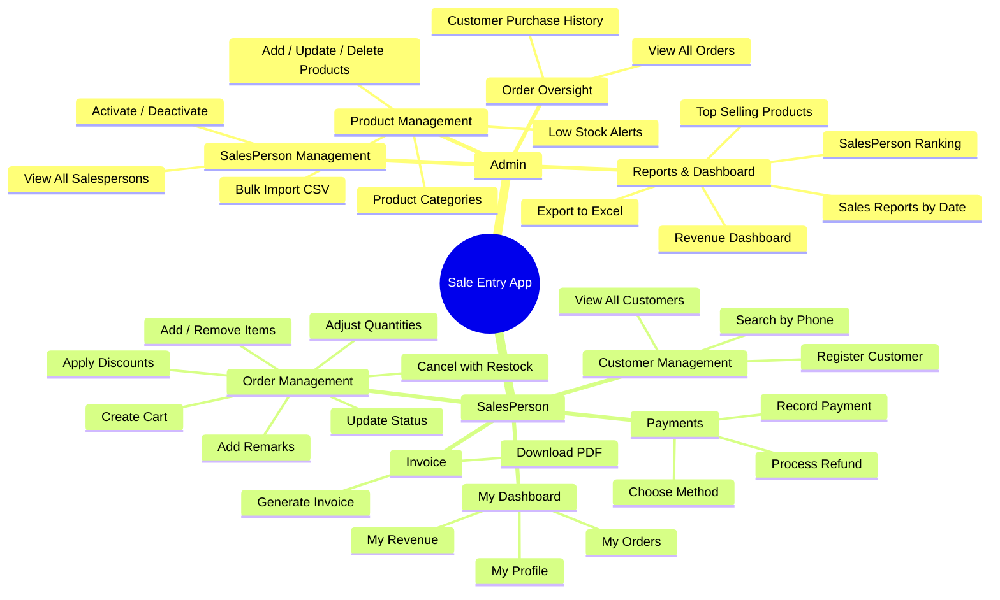

# Advanced Features — Sale Entry App

Here's everything you can add to take your app from a basic CRUD to an impressive, production-grade system. Organized into **3 tiers** by difficulty.

---

## 🟢 Tier 1 — Quick Wins (Easy but impactful)

These are missing from your current system and are **expected** in any real app.

---

### Admin Features

| # | Feature | What It Does | Difficulty |
|---|---------|-------------|:---:|
| 1 | **View all products** | `GET /products` — Admin can see the entire product catalog | ⭐ |
| 2 | **Delete a product** | `DELETE /products/{id}` — Remove a product (only if not in any active order) | ⭐ |
| 3 | **View all salespersons** | `GET /admin/salespersons` — Admin can see list of all registered salespersons | ⭐ |
| 4 | **View all orders** | `GET /admin/orders` — Admin can see every order in the system (currently only SalesPerson can) | ⭐ |
| 5 | **Search product by name** | `GET /products/search?name=rice` — Find products by partial name match | ⭐⭐ |
| 6 | **Low stock alert** | `GET /admin/products/low-stock?threshold=10` — List products with stock below a threshold | ⭐⭐ |

### SalesPerson Features

| # | Feature | What It Does | Difficulty |
|---|---------|-------------|:---:|
| 7 | **View own profile** | `GET /salesperson/me` — See own details using the JWT token | ⭐ |
| 8 | **Update own profile** | `PUT /salesperson/me` — Update phone, name (not email/role) | ⭐ |
| 9 | **View available products** | `GET /products` (read-only) — SalesPerson can browse product catalog before creating orders | ⭐ |
| 10 | **View only MY orders** | `GET /orders/my-orders` — Filter orders by logged-in salesperson automatically (from JWT) | ⭐⭐ |
| 11 | **Search customer by phone** | `GET /customers/search?phone=98xxx` — Find existing customer quickly | ⭐ |
| 12 | **Remove item from cart** | `DELETE /orders/removeItem/{orderItemId}` — Completely remove an item (restock product) | ⭐⭐ |

### System-Level Fixes

| # | Feature | What It Does | Difficulty |
|---|---------|-------------|:---:|
| 13 | **Fix security gap** | Uncomment `.anyRequest().authenticated()` — Block all unprotected endpoints | ⭐ |
| 14 | **Get order by ID** | `GET /orders/{id}` — View details of a specific order | ⭐ |
| 15 | **Prevent duplicate customers** | Check if phone number already exists before registering | ⭐ |
| 16 | **Prevent duplicate products** | Check if product name + weight combo already exists | ⭐ |

---

## 🟡 Tier 2 — Strong Additions (Medium effort, high value)

These make your project stand out in a **college demo or interview**.

---

### 📊 Dashboard & Reports (Admin)

| # | Feature | What It Does | Difficulty |
|---|---------|-------------|:---:|
| 17 | **Revenue dashboard** | `GET /admin/dashboard` — Total revenue, total orders, total customers, top salesperson | ⭐⭐ |
| 18 | **Daily/Monthly sales report** | `GET /admin/reports/sales?from=2026-01-01&to=2026-06-01` — Revenue in a date range | ⭐⭐ |
| 19 | **Top selling products** | `GET /admin/reports/top-products?limit=5` — Products ordered the most | ⭐⭐⭐ |
| 20 | **SalesPerson performance** | `GET /admin/reports/salesperson-ranking` — Rank salespersons by revenue, orders | ⭐⭐⭐ |
| 21 | **Customer purchase history** | `GET /admin/customers/{id}/history` — All orders by a customer across all salespersons | ⭐⭐ |

### 🛒 Order Enhancements (SalesPerson)

| # | Feature | What It Does | Difficulty |
|---|---------|-------------|:---:|
| 22 | **Order status state machine** | Enforce valid transitions: `DRAFT → CONFIRMED → PROCESSING → DELIVERED → CANCELLED` — reject invalid ones like `DELIVERED → DRAFT` | ⭐⭐⭐ |
| 23 | **Apply discount to order** | `PUT /orders/{id}/discount?percent=10` — Apply a percentage discount to the total | ⭐⭐ |
| 24 | **Add custom quantity** | `POST /orders/{productId}/addToCart/{orderId}?qty=5` — Add 5 units at once instead of clicking +1 five times | ⭐⭐ |
| 25 | **Order notes/remarks** | Add a `remarks` field to SaleOrder — salesperson can write special instructions | ⭐ |
| 26 | **Cancel order with stock restore** | When cancelling, auto-restore all product stock quantities | ⭐⭐ |

### 🔐 Security & Auth Enhancements

| # | Feature | What It Does | Difficulty |
|---|---------|-------------|:---:|
| 27 | **Password change** | `PUT /auth/change-password` — Change password (require old password) | ⭐⭐ |
| 28 | **JWT refresh token** | Issue short-lived access token (15min) + long-lived refresh token (7 days) | ⭐⭐⭐ |
| 29 | **Logout / token blacklist** | `POST /auth/logout` — Invalidate the current JWT token | ⭐⭐⭐ |
| 30 | **Admin can deactivate salesperson** | `PUT /admin/salespersons/{id}/deactivate` — Block a salesperson from logging in | ⭐⭐ |

### 📄 New Entity: Invoice / Bill

| # | Feature | What It Does | Difficulty |
|---|---------|-------------|:---:|
| 31 | **Generate invoice** | `GET /orders/{id}/invoice` — Return a structured JSON invoice with all items, totals, tax | ⭐⭐⭐ |
| 32 | **Invoice PDF export** | Generate a downloadable PDF invoice using a library like iText or JasperReports | ⭐⭐⭐⭐ |

---

## 🔴 Tier 3 — Advanced / Enterprise-Grade (Impressive for interviews)

These are features that show you think like a **professional backend engineer**.

---

### 💳 Payment Module (New)

| # | Feature | What It Does | Difficulty |
|---|---------|-------------|:---:|
| 33 | **Payment entity** | Track payments: amount, method (`CASH`, `CARD`, `UPI`), status (`PENDING`, `COMPLETED`, `REFUNDED`) | ⭐⭐⭐ |
| 34 | **Partial payments** | Allow paying in installments — track paid vs remaining amount | ⭐⭐⭐⭐ |
| 35 | **Refund processing** | `POST /payments/{id}/refund` — Refund a completed payment, restore order status | ⭐⭐⭐⭐ |

### 📦 Inventory Management (Admin)

| # | Feature | What It Does | Difficulty |
|---|---------|-------------|:---:|
| 36 | **Stock movement log** | Track every stock change: +50 restocked, -3 sold, +3 order cancelled — full audit trail | ⭐⭐⭐ |
| 37 | **Product categories** | New `Category` entity — group products (e.g., "Grains", "Dairy", "Beverages") | ⭐⭐ |
| 38 | **Bulk product import** | `POST /admin/products/import` — Upload CSV to add many products at once | ⭐⭐⭐⭐ |

### 📈 Analytics & Notifications

| # | Feature | What It Does | Difficulty |
|---|---------|-------------|:---:|
| 39 | **Email notification** | Send email when order is confirmed or status changes (using Spring Mail) | ⭐⭐⭐ |
| 40 | **Scheduled reports** | Auto-generate daily sales summary at midnight using `@Scheduled` | ⭐⭐⭐ |
| 41 | **Export data to Excel** | `GET /admin/reports/export?format=excel` — Download orders/products as Excel file | ⭐⭐⭐⭐ |

### 🏗️ Architecture Upgrades

| # | Feature | What It Does | Difficulty |
|---|---------|-------------|:---:|
| 42 | **Pagination on all lists** | Return paginated results instead of loading everything at once | ⭐⭐ |
| 43 | **Soft delete** | Don't actually delete records — add `isDeleted` flag, filter them out of queries | ⭐⭐ |
| 44 | **Audit trail** | `createdAt`, `updatedAt`, `createdBy`, `updatedBy` on every entity using JPA Auditing | ⭐⭐⭐ |
| 45 | **API rate limiting** | Limit login attempts to prevent brute-force attacks | ⭐⭐⭐⭐ |

---

## 🎯 My Recommended Priority Order

If you want maximum impact with minimum effort, implement in this order:

```
Phase A  (1-2 days each)
  ├── #13  Fix security gap (.anyRequest().authenticated())
  ├── #1   View all products
  ├── #9   SalesPerson can browse products
  ├── #12  Remove item from cart
  ├── #10  View MY orders (from JWT)
  ├── #14  Get order by ID
  └── #15  Prevent duplicate customers

Phase B  (2-3 days each)
  ├── #22  Order status state machine (DRAFT → CONFIRMED → ...)
  ├── #17  Admin dashboard (total revenue, orders, top salesperson)
  ├── #26  Cancel order with stock restore
  ├── #27  Password change
  └── #37  Product categories

Phase C  (3-5 days each)
  ├── #33  Payment module
  ├── #31  Invoice generation
  ├── #36  Stock movement log
  ├── #44  Audit trail (createdAt, updatedAt)
  └── #42  Pagination

Phase D  (Interview differentiators)
  ├── #28  JWT refresh tokens
  ├── #39  Email notifications
  ├── #40  Scheduled reports
  └── #20  SalesPerson performance ranking
```

---

## 📊 Updated Role Comparison (After All Features)


