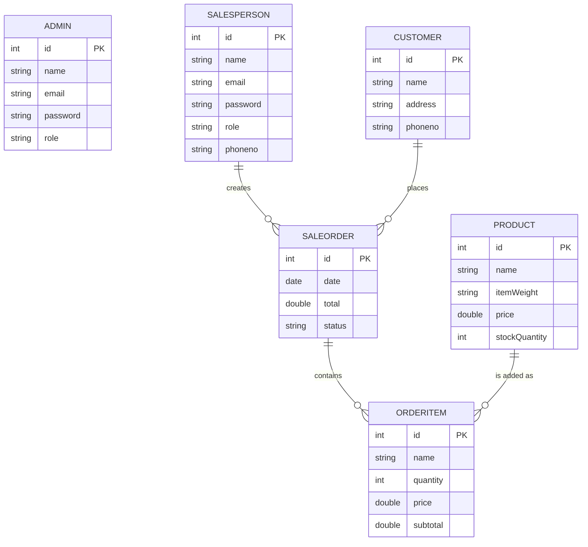
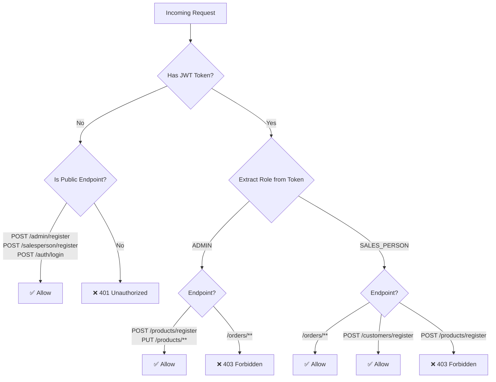

# Sale Entry App — System Functionality by Role

## System Overview

The **Sale Entry App** is a backend REST API for managing sales orders. It has **2 user roles** and manages **4 core entities** (Customer, Product, SaleOrder, OrderItem).

---

## 🔐 Roles in the System

| Role | Who | Purpose |
|------|-----|---------|
| **ADMIN** | Store owner / Manager | Manages the product catalog (inventory) |
| **SALES_PERSON** | Field salesperson / Counter staff | Creates orders for customers, manages the sales process |

---

## 🔑 Authentication (Common to Both Roles)

| Action | API Endpoint | Access | Description |
|--------|-------------|--------|-------------|
| Register as Admin | `POST /admin/register` | **Public** (no login needed) | Create a new admin account with name, email, password |
| Register as SalesPerson | `POST /salesperson/register` | **Public** (no login needed) | Create a new salesperson account with name, email, password, phone |
| Login | `POST /auth/login` | **Public** (no login needed) | Authenticate with email + password → receive **JWT token** |

> [!NOTE]
> After login, the JWT token must be sent in the `Authorization` header for all subsequent requests. The token contains the user's role (`ADMIN` or `SALES_PERSON`).

---

## 👔 Admin — What They Can Do

The Admin's primary responsibility is **managing the product catalog** (inventory).

### Product Management

| # | Task | API Endpoint | Description |
|---|------|-------------|-------------|
| 1 | **Add a new product** | `POST /products/register` | Register a new product with name, weight, price, and stock quantity |
| 2 | **Update a product** | `PUT /products/update/{id}` | Update product details (name, weight, price, stock) by product ID |

### Admin Workflow (Day-to-Day)

```
Admin logs in
    │
    ├──► Add new products to the catalog
    │       (e.g., "Rice 5kg - ₹250 - Stock: 100")
    │
    ├──► Update existing product details
    │       (e.g., change price, restock quantity)
    │
    └──► [Future] View reports, manage salespersons, etc.
```

> [!IMPORTANT]
> Currently the Admin role is **limited to product management only**. They cannot view orders, manage salespersons, or see revenue reports through their role-restricted endpoints.

---

## 🧑‍💼 SalesPerson — What They Can Do

The SalesPerson's primary responsibility is **creating and managing customer orders**. This is the most active role in the system.

### Customer Management

| # | Task | API Endpoint | Description |
|---|------|-------------|-------------|
| 1 | **Register a customer** | `POST /customers/register` | Add a new customer with name, address, phone number |
| 2 | **View all customers** | `GET /customers` | List all registered customers |

### Order Creation & Cart Management

| # | Task | API Endpoint | Description |
|---|------|-------------|-------------|
| 3 | **Create a new order (cart)** | `POST /orders/{salespersonId}/createCart/{customerId}` | Create an empty sale order linked to a salesperson and customer |
| 4 | **Add product to cart** | `POST /orders/{productId}/addToCart/{orderId}` | Add a product to an existing order (creates an OrderItem, deducts stock) |
| 5 | **Increase item quantity** | `PUT /orders/incrsQty/{orderItemId}` | Increase quantity of an item in the cart by 1 |
| 6 | **Decrease item quantity** | `PUT /orders/dcrsQty/{orderItemId}` | Decrease quantity of an item in the cart by 1 |

### Order Viewing & Filtering

| # | Task | API Endpoint | Description |
|---|------|-------------|-------------|
| 7 | **View all orders** | `GET /orders/viewOrders` | List all sale orders in the system |
| 8 | **Filter orders by customer** | `GET /orders/filter/customer/{customerId}` | View all orders for a specific customer |
| 9 | **Filter orders by status** | `GET /orders/filter/status/{status}` | View all orders with a specific status (e.g., "PENDING") |
| 10 | **Calculate revenue** | `GET /orders/totalrev/{salespersonId}` | Calculate total revenue for a specific salesperson |

### Order Status Management

| # | Task | API Endpoint | Description |
|---|------|-------------|-------------|
| 11 | **Update order status** | `PUT /orders/updatestatus/{orderId}` | Change order status (e.g., PENDING → COMPLETED) |

### Order Deletion

| # | Task | API Endpoint | Description |
|---|------|-------------|-------------|
| 12 | **Delete all orders** | `DELETE /orders` | Delete every sale order in the system |
| 13 | **Delete order by ID** | `DELETE /orders/dltbyid/{id}` | Delete a specific order |
| 14 | **Delete by salesperson** | `DELETE /orders/dltbysalesPersonId/{id}` | Delete all orders of a specific salesperson |
| 15 | **Delete by customer** | `DELETE /orders/dltbycustomerId/{id}` | Delete all orders of a specific customer |
| 16 | **Delete by status** | `DELETE /orders/dltbyStatus/{status}` | Delete all orders with a specific status |
| 17 | **Delete by date** | `DELETE /orders/dltbyDate/{date}` | Delete all orders on a specific date |

### SalesPerson Workflow (Day-to-Day)

```
SalesPerson logs in
    │
    ├──► Register a new customer (if first-time buyer)
    │       (name, address, phone)
    │
    ├──► Create a new sale order (cart)
    │       (link to themselves + the customer)
    │
    ├──► Add products to the cart
    │    │
    │    ├──► Product added → stock auto-deducted
    │    ├──► Increase quantity (+1)
    │    └──► Decrease quantity (-1)
    │
    ├──► Subtotal & Total auto-calculated
    │
    ├──► Update order status
    │       (e.g., PENDING → COMPLETED)
    │
    ├──► View / filter past orders
    │       (by customer, status, etc.)
    │
    └──► Check their total revenue
```

---

## 📊 Entity Relationship Diagram



---

## 🔒 Security Rules Summary



---

## 📋 Quick Comparison Table

| Functionality | Admin | SalesPerson | Public |
|---------------|:-----:|:-----------:|:------:|
| Register (own account) | ✅ | ✅ | ✅ |
| Login | ✅ | ✅ | ✅ |
| Add Product | ✅ | ❌ | ❌ |
| Update Product | ✅ | ❌ | ❌ |
| Register Customer | ❌ | ✅ | ❌ |
| View All Customers | ⚠️ *not restricted* | ✅ | ❌ |
| Create Order (Cart) | ❌ | ✅ | ❌ |
| Add to Cart | ❌ | ✅ | ❌ |
| Increase/Decrease Qty | ❌ | ✅ | ❌ |
| View Orders | ❌ | ✅ | ❌ |
| Filter Orders | ❌ | ✅ | ❌ |
| Update Order Status | ❌ | ✅ | ❌ |
| Delete Orders | ❌ | ✅ | ❌ |
| Calculate Revenue | ❌ | ✅ | ❌ |

> [!WARNING]
> The `GET /customers` endpoint does not have explicit role restriction in the security config. It might be accessible to anyone with a valid JWT token (both Admin and SalesPerson), or even unauthenticated users since `.anyRequest().authenticated()` is commented out in the security config.

---

## 🔄 Typical System Flow (End-to-End)

```
1. Admin registers    ──►  POST /admin/register
2. Admin logs in      ──►  POST /auth/login  →  gets JWT
3. Admin adds products──►  POST /products/register  (×N products)

4. SalesPerson registers ──►  POST /salesperson/register
5. SalesPerson logs in   ──►  POST /auth/login  →  gets JWT

6. Customer walks in
7. SalesPerson registers customer ──►  POST /customers/register

8. SalesPerson creates cart       ──►  POST /orders/{spId}/createCart/{custId}
9. SalesPerson adds products      ──►  POST /orders/{prodId}/addToCart/{orderId}
   (stock auto-deducted, subtotal auto-calculated)

10. Adjust quantities if needed   ──►  PUT /orders/incrsQty/{itemId}
                                       PUT /orders/dcrsQty/{itemId}

11. SalesPerson confirms order    ──►  PUT /orders/updatestatus/{orderId}
    (body: {"status": "COMPLETED"})

12. SalesPerson checks revenue    ──►  GET /orders/totalrev/{spId}
```
